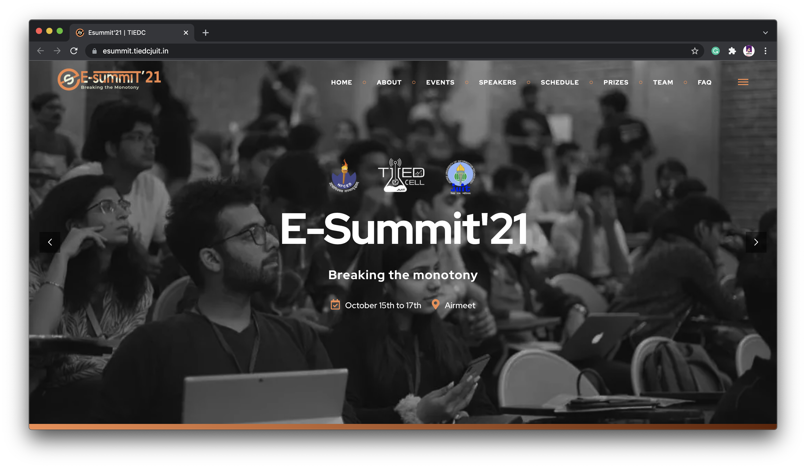
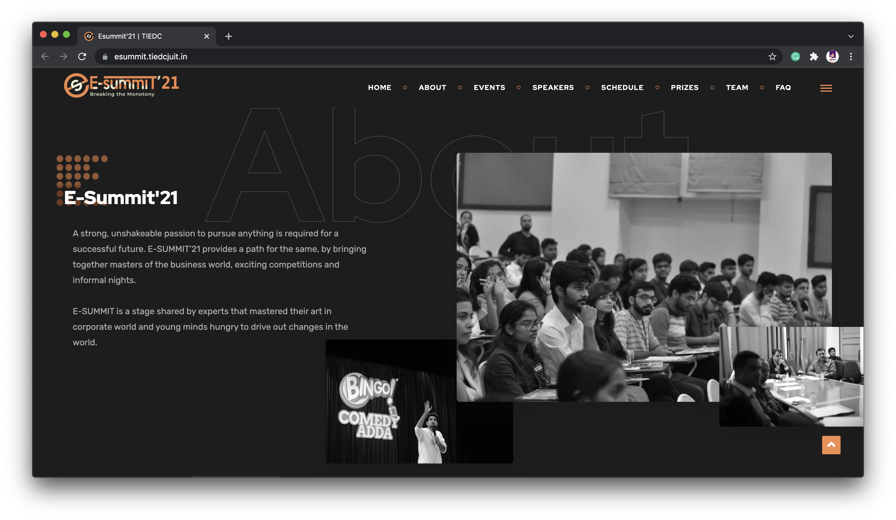
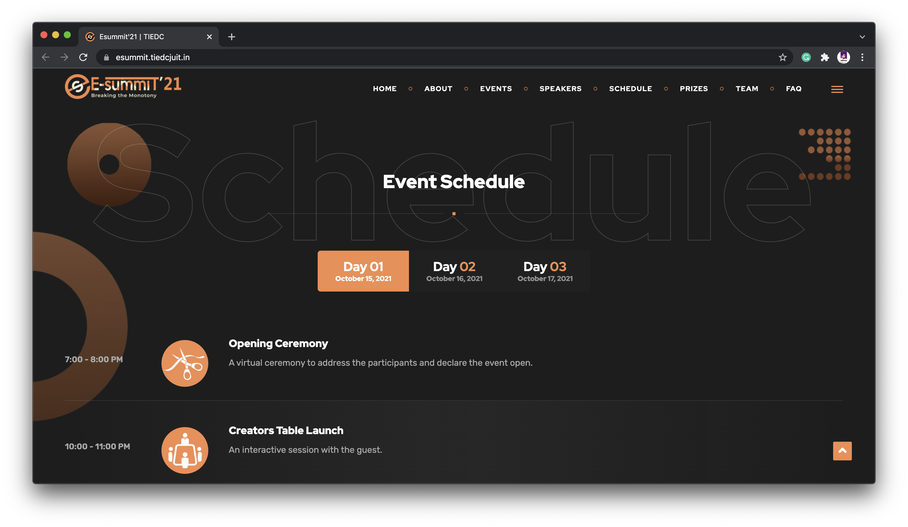
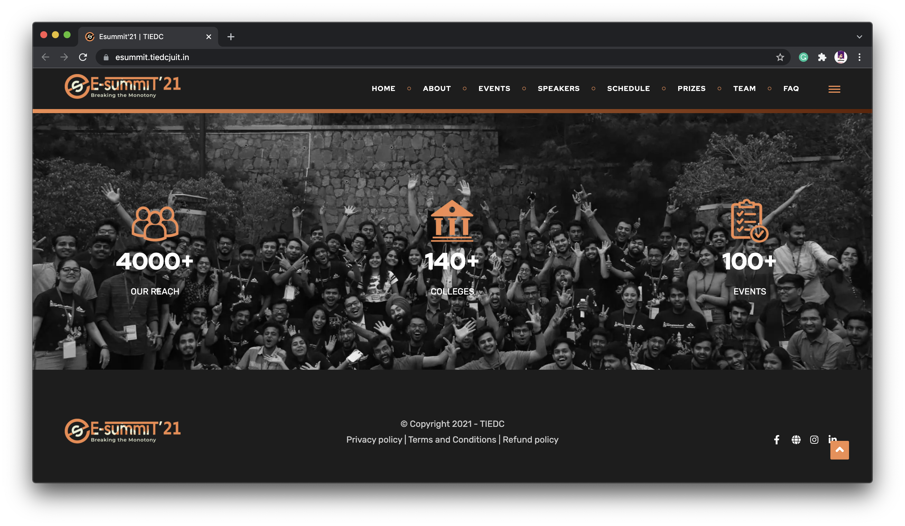

# Official Website for E-Summit 2021 | TIEDC JUIT

A strong, unshakeable passion to pursue anything is required for a successful future. E-SUMMIT’21 provides a path for the same, by bringing together masters of the business world, exciting competitions and informal nights.
E-SUMMIT is a stage shared by experts that mastered their art in corporate world and young minds hungry to drive out changes in the world.

## TIEDC JUIT

The Technology Incubation and Entrepreneurship Development cell of JUIT aims at developing an entrepreneurial spirit and shares a vision to foster innovation and budding ideas amongst the students . The cell facilitates with a practical edge of exposing the students to hands-on experience of entrepreneurship through initiatives like Startup Simulator, E-summit, Networking Series, alumini interactions and interactive sessions with existing Entrepreneurs and Venture Capitalists. TIEDC is supported by the Department of Industries, Himachal Pradesh under Chief Minister’s Start-up/Innovation Projects/New Industries Scheme.

[Official Website](https://tiedcjuit.in/)
